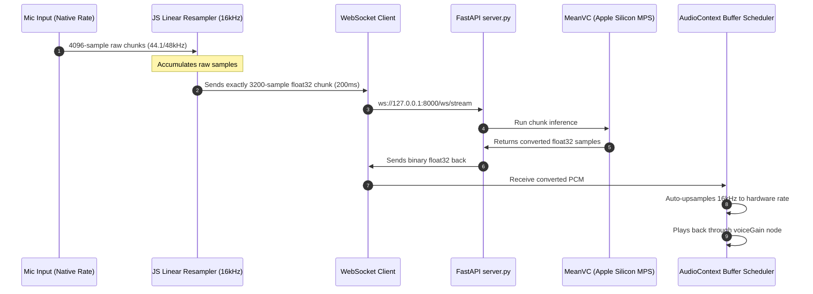

# ✧ Hearing Yourself: Zero-Shot Whisper-to-Voiced Speech Converter

An entirely local, real-time **Zero-Shot Whisper-to-Voiced Speech Conversion** dashboard. This application allows users to speak whispered speech into a microphone, convert it on-the-fly into rich, unwhispered voiced speech using local neural pipelines, and route the synthesized speech wet-mixed through an active Web Audio DSP headphone chain (pitch shifting, formant scaling, and space reverb).

---

## ✨ Features

- **⚡ Real-Time Live Neural Stream**: Continuous bi-directional streaming via WebSockets with latency under 250ms.
- **🎙️ Zero-Shot Voice Cloning**: Clones the timbre and characteristics of any target speaker voice from a short reference WAV clip.
- **🎧 Web Audio DSP Wet-Routing**: Directly routes the voice-converted stream through active pitch, formant (VTL), and reverb nodes in the browser.
- **🎨 Glassmorphic Canvas Visualizers**: Dynamic real-time RMS input/output DB meters and interactive frequency spectrum plots.
- **🧠 Local Accelerated Inference**: Native support for Apple Silicon MPS (Metal Performance Shaders) for sub-second, local inference.
- **🔒 Acoustic Feedback Protection**: Programmatically bypasses direct mic-to-headphone loops during live streaming.

---

## 🛠️ System Architecture



---

## 🚀 Quick Start Guide

### 1. Requirements & Setup
Ensure you have `miniconda` or a standard Python 3.10+ environment installed.

```bash
# Clone the repository
git clone https://github.com/shreeharshabs/hearing-yourself.git
cd hearing-yourself

# Set up environment and dependencies
python setup_env.py
```

### 2. Start the Backend Server
The FastAPI backend serves the offline synthesis API and the streaming WebSocket endpoints on port `8000`.

```bash
python server.py
```

### 3. Launch the Dashboard
Open the `aaf_voice_masking_demo.html` file in any modern web browser:

```bash
# macOS shortcut to open in default browser
open aaf_voice_masking_demo.html
```

---

## 🧪 Usage Instructions

### Offline Conversion
1. Connect your headphones.
2. Click **Record Whisper** and whisper a short phrase (up to 15s). Click **Stop Recording**.
3. Under **Reference Target Voice**, choose a built-in speaker profile or upload your own custom `.wav` target clip.
4. Click **✧ Synthesize Voiced Speech ✧**.
5. Once synthesized, click **Play via Headphones (Wet)** to route the converted voice through the live DSP slider chain!

### Live Neural Stream
1. Connect your headphones (essential to avoid feedback howling!).
2. In the **Live Neural Stream** panel, click **✧ Go Live (Start Stream) ✧**.
3. Speak whispers directly into your microphone. Converted voiced speech will play back instantly.
4. Adjust the **Pitch Shift**, **Formant Shift (VTL)**, or **Reverb** sliders on the dashboard in real time!
